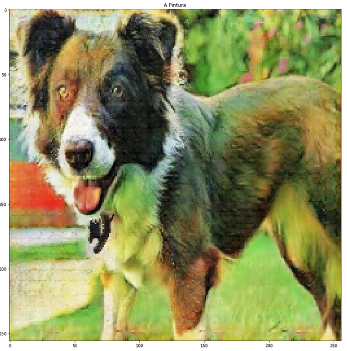

# Entregable del proyecto

## Introducción

Nuestro proyecto está enfocado en transferir el estilo de una imagen a otra usando GANs (Generative Adversarial
Networks). La transferencia de estilo en imágenes nació en 2017 y ha evolucionado al pasar los años. 
En un principio se extraía el estilo de una y el contenido de otra, se les asignaba un peso y se generaba
una imagen nueva. El elfoque más moderno es usando GANs. La aplicación de GANs en esta disciplina  permite tener
una red ya entrenada que convierta las imágenes de manera rápida. Investigando encontramos proyectos interesantes 
que han hecho otras personas, el más interesante fue uno en el que se pasaba fortnite a estilo PUB-G en tiempo
real, ambos son juegos de estilo Battle Royale. 

## Descripción

Específicamente, vamos a transferir fotos a pinturas al estilo Vincent van Gogh. Las GANs son una arquitectura
en la que entrenas dos redes neuronales al mismo tiempo e intentas hacer que una engañe a la otra. Vamos a tener 
una red llamada Discriminador y otra que se llama Generador. El generador va generar imágenes basadas en 
fotos reales y va a intenrar engañar al discriminador, cuando logra engañarlo se castiga al Discriminador y 
cuando no lo logra se castiga al generador. Básicamente son dos redes neuronales compitiendo. 

Nos basamos en el siguiente [paper](https://arxiv.org/abs/1703.10593). Usamos el este 
[dataset](https://www.tensorflow.org/datasets/catalog/cycle_gan#cycle_ganvangogh2photo) de tensorflow. 
El [tutorial](https://www.tensorflow.org/tutorials/generative/cyclegan) que seguimos y adaptamos para convertir fotos 
a pinturas. 
Este es [notebook](https://github.com/FranciscoBuru/ML/blob/master/PFinal/src/Proyecto.ipynb) contiene el código usado.

Vamos a entrenar a la red con un dataset que tiene pinturas de van Gogh e imágenes donde predominan los paisajes. 
En cada cíclo de entrenamiento se le van a hacer pequeños cambios a cada imagen para que haya cierta variabilidad en los inputs.
De las imágenes tomamos subsecciones 256x256 pixeles y se voltean con cierta probabilidad en cada iteración.
El generador y discriminador son los mismos que usamos en el ejemplo anterior. Al entrenar hacemos varios cambios en las funciones de pérdida.

Queremos mandar una imagen de un dominio `X` a un dominio `Y` y sin que la imagen en `X` pierda estructura principal por
lo que tendremos que aplicar una función inversa que vaya de `Y` a `X` y comparar la imagen convertida dos veces con la original
minimizando las diferencias entre ambas imágenes.

Declaramos las funciones que transformarán imágenes de un dominio a otro: `G: X -> Y` y `F: Y -> X`.

El discriminador `D_X` aprenderá a diferenciar imágenes en `X` y las generadas `X = F(Y)`
y el discriminador `D_Y` aprenderá a diferenciar imágenes en `Y` y las generadas `Y = G(X)`

Primero, a diferencia de un [Pix2Pix](https://github.com/FranciscoBuru/ML/blob/master/PFinal/src/Pix2Pix.ipynb) nosotros
no tenemos una imagen objetivo por lo que queremos crear una. Importamos los generadores y discriminadores que usamos en 
ese ejemplo. 

La parte más interesante son las funciónes de pérdida. 
A diferencia de Pix2Pix, en este tipo de aplicaciones no tenemos una imagen objetivo por lo que sería ideal generar una de
alguna forma. 
La idea más natural es hacer una doble conversión, mandar a la imagen `a` de `X` a `Y` y el resultado regresarlo de `Y` a
`X`. 

Primero tenemos que tomar en cuenta la pérdida de consistencia entre
la imagen original y la imagen "objetivo" en el dominio original. Lo que queremos minimizar es la siguiente distancia:
`|X- F(G(X)| ` así aseguraremos que dentro de todo las imágenes sean parecidas estructuralmente. 
También queremos asegurarnos que la identidad de las imágenes se mantenga en las GANs, esto es: Si alimentamos a la
función ` G: X -> Y ` una imagen que se encuentre en `Y` entonces esperamos que el output de la función sea casi 
idéntico a la foto original por lo que también minimizaremos sobre las distancias  `|G(Y)-Y|` y `|F(X)-X|` 
Usamos una función de tipo Mean Squared error para reducir la pérdida de consistencia. Introducimos el concepto de pérdida
de 
identidad, esto es, una imagen en `X` y la misma imagen operada por `F(X)` deben de ser la misma (recordar `(F: Y -> X)`). 
Para minimizar la pérdida de identidad tomamos el valor absoluto de las diferencias usando `X` y `Y`. 

Para el generador usamos `tf.keras.layers.Input()`. El generador tiene 21 capas 
intermedias; la mitad son de entrada (van hacia adentro) y las demás de salida (reconstuyen la imagen.) Se le asigna una
función de pérdida de tipo sigmoidal al generador para obligar que la imagen generada sea estructuralmente parecida a la
objetivo. El procedimiento pare entrenar al generador es el siguiente, cambiando Input Image por la imagen que cambió de
dominio dos veces:

El discriminador igual se construyó y es del tipo PatchGAN, tipo de redes neuronales que penaliza la estuctura de la imagen 
en subsecciones de la misma. El discriminador recibe un total de 3 imágenes: Input, target e imagen generada. La función de 
pérdida del discriminador es entrópica. El prodecimiento para entrenar al discriminador es el siguiente, cambiando Input
Image por la imagen que cambió de dominio dos veces:

Para poder reconstruir el modelo entrenado en cualquier momento y usarlo usamos checkpoints, los checkpoints nos permiten 
cargar los pesos de una red entrenada. Guardamos un checkpoint cada 5 iteraciones. Durante el entrenamiento siempre vamos a 
mostrar la misma imagen original y traducida para poder ver la mejora de la GAN. Cada época tardó en promedio 200 segundosy 
entrenamos durante 200 épocas por lo que el tiempo de entrenamiento fue de poco más de 11 horas.  

## Resultados principales

Después de entrenar el modelo durante 11 horas encontramos resultados interesantes. Las fotos con las que se entrenó a 
la GAN tienen una muy buena traducción entre dominios y en general quedan muy bien: 

Cuando aplicamos la transferencia de estilo a imágenes que no estaban en el dataset de entrenamiento se generan imágenes
que no son tan buenas si la imagen es un paisaje, en el momento que metemos imágenes de, por ejemplo, un perro o una 
persona, la imagen resultante es bastante mala. 

Si, por ejemplo, quisieramos traducir imágenes del ITAM a algún estilo,
lo mejor sería entrenar a la GAN con un dataset que contenga mayoritariamente fotos del ITAM. Para poder usar un dataset
propio se debe hacer algo parecido a lo ejecutado en las últimas líneas del notebook y así cargar a tensorflow las
imágenes con las que queremos entrenar a la red. Por practicidad usamos un dataset ya hecho, hacer uno nosotros nos habría
tomado un tiempo considerable.

## Criterios de evaluación

* Medir la eficiencia de las GANs es tarea complicada. Para nuestro proyecto podríamos medir la eficiencia de las
funciones `F` y `G` al medir las pérdidads de identidad pero no sabremos que tan bien se va a comportar con fotos
externas. Cuando queremos medir que tan buena es con respecto al training set se pueden obtener resultados buenos 
pero al alimentar datos externos los resultados pueden ser algo extraños. En nuestro proyecto podemos apreciar estas
grandes diferencias visualmente pues trabajamos con fotos.

* Naturalmente pensamos en métodos de evaluación de la eficiencia de las GANs, una primera idea para ver que tan 
efectiva es una nueva época de entrenamiento sería poner poner una cota inferior a la distancia de la pérdida 
total del sistema entre dos generaciones. Por otro lado, evaluar que tan buena es la GAN lo podríamos hacer
dándole un nuevo train dataset en un dominio, ya sea `X` o `Y` y ver que tan rápido converge la pérdida 
intergeneracional a la cota inferior dada. Modelando los tiempos como variables aleatorias exponenciales podríamos 
establecer intervalos de confianza para la convergencia de nuestra pérdida intergeneracional dado que se tiene alguna
muestra grande (usualmente grande es `n>30`). 

## Conclusiones

* Subestimamos la complejidad del proyecto propuesto
* Nuestra GAN es muy buena al traducir imágenes con las que se entrenó pero no es lo mejor con imágenes nuevas.
* El tiempo de computación y el nivel de complejidad fueron muy altos, dedicamos más de 23 horas hombre a la elaboración
del proyecto pues nos enfocamos en entender qué estabamos haciendo. Dados los altos tiempos de entrenamiento pensamos
que el desarrollo profesional de este tipo de redes es costoso por la necesidad de cómputo de alto desempeño durante
varias horas.  

## Reflexiones

* En la práctica, el manejo de datos y creación de datasets es lo más tardado cuando qeremos usar aprendizaje de máquina.
Los ejemplos más comunes de aprendizaje sun puramente explicativos (i.e. los que usan iris dataset) y en realidad la parte
más divertida es el análisis ya tienes datosconfiables que puedas procesar.
* La base del aprendizaje de máquina está en optimización numérica de funciones escalares y el algebra lineal. Algoritmos
populares hoy, por ejemplo BFGS (Quasi-Newton) fueron propuestos hace más de 20 años. El incremento en la capacidad de
procesamiento es lo que ha llevado a la aplicación de éste y muchos otros métodos de optimización que llevan años
existiendo. De hecho, es interesante reflexionar sobre la época en la que la optimización 
numérica tomó fuerza, la segunda guera mundial; así, de cierta forma, sin segunda guerra mundial hoy las disciplinas del
aprendizaje de máquina y la inteligencia artificial no estarían tan desarrollados o talvez ni existirían. 

