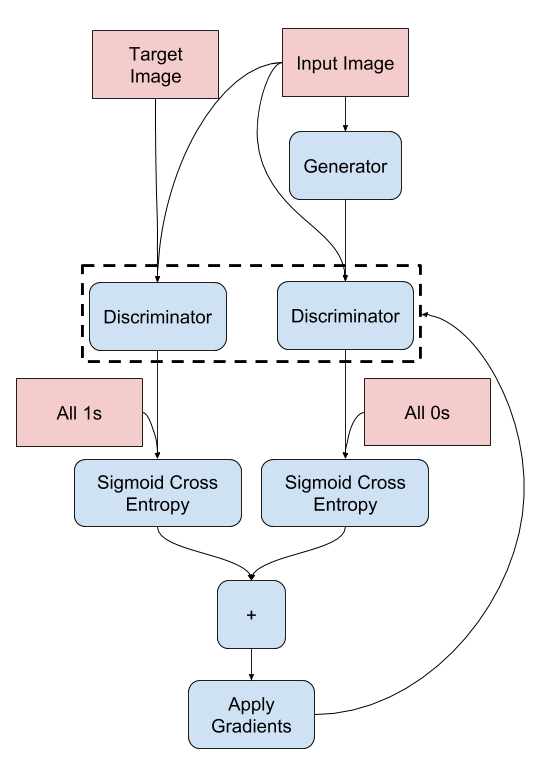
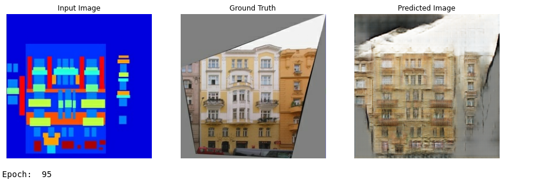
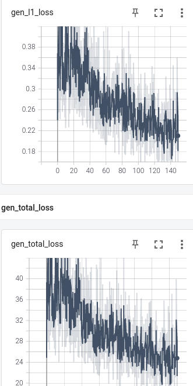

# Proyecto Final Aprendizaje de Máqina

## Descripción

Proyecto elaborado para la materia de Aprendizaje de Máquina impoartida en el ITAM durante el semestre Otoño 2020. Propusimos usar GANs (Generative Adversarial 
Networks)
y entrenar una red que conviertiera imágenes normales a pinturas al estilo de Vincent van Gogh. Para lograr esto; primero debimos entender qué es tensorflow y 
aprender
a usarlo, luego entender la historia de transferencia de estilo en imágenes, después aprender a manejar GANs y finalmente usarlas para nuestro proyecto.

El proyecto está basado en el paper [Unpaired Image-to-Image Translation using Cycle-Consistent Adversarial Networks](https://arxiv.org/abs/1703.10593), si se desea
replicar el proyecto también recomendamos leer los siguientes papers: [Primero](https://arxiv.org/abs/1502.03167),  [Segundo](https://arxiv.org/abs/1607.08022) y 
[Tercero](https://arxiv.org/abs/1508.06576). 

## Set-Up
Todo el código del proyecto fue corriedo en una máquina con procesador Intel Core i7-9750H @2.60GHz y una tarjeta de video nvidia GTX 1660 Ti en su versión para 
laptop. La configuración importante del ambiente de programación es la siguiente:
* python 3.x con jupyter notebooks
* tensorflow-gpu 2.3.1
* CUDA 10.1
* Pop!_OS 20.10


En caso de tener versiones posteriores de cuda recomendamos [este](https://medium.com/@praveenkrishna/downgrade-cuda-for-tensorflow-gpu-17831db59099) post que explica
cómo hacer un downgrade de los drivers. Si se va a realizar un fresh install el siguiente 
[post](https://towardsdatascience.com/installing-tensorflow-gpu-in-ubuntu-20-04-4ee3ca4cb75d) es bueno.

Para revisar tensorflow encontró un GPU ejecutar el siguiente [código](https://github.com/FranciscoBuru/ML/blob/master/PFinal/src/Untitled.ipynb), la salida debe
coincidir con la que se muestra.

## Transferencia de estilos
Primero debemos entender que es y cómo funciona la transferencia de estilo. Este tipo de disciplina inició en 2015 y uno de los primeros papers formales
al respecto fue [este](https://arxiv.org/pdf/1508.06576.pdf). El código para esta sección del proyecto lo pueden encontrar 
[aquí](https://github.com/FranciscoBuru/ML/blob/master/PFinal/src/Tut_NST.ipynb). 

Importante: En nuestro caso tuvimos que incluir el siguiente código después de importar tensorflow para que las cosas funcionaran.

```python
config = tf.compat.v1.ConfigProto()
config.gpu_options.allow_growth = True
session = tf.compat.v1.Session(config=config)
```
En esta sección hicimos transfer learning (Usamos una parte de una red neuronal ya entrenada para reconocimiento de objetos en imágenes y extrajimos la sección de 
la red que aprendió a "ver" a las imágenes, especialmente las partes que ven el contenido y el estilo de la imagen.) con la red de google VGG19.

En esencia lo que se hace es escoger una imagen de estilo y una de contenido, la red va a aplicar el estilo a la imagen de contenido. La función que se usa para 
optimizar es de del tipo de decenso de gradiente estoástico (ADAM). Podemos decidir que tanto influencían el estilo y el contenido dándoles pesos. 
pesos.
````python
style_weight=1e-1
content_weight=1e4
````
La transferencia de estilo usa como base la clase `StyleContentModel(tf.keras.models.Model)` que se encarga de preprocesar con VGG19 y calcula los outputs de 
estilo usando una matrices de Gram. Después de pasar por el prepocesamiento generamos una pérdida de contenido con `style_content_loss(outputs)` que calcula 
la distancia entre los outputs, targets y multiplica por los pesos definidos anteriormente. El gradiente de la pérdida (existe pues es función escalar) se le aplica
a la imagen y con esto concluye una época de entrenamiento. 

Al final del notebook se aplicó la función a una foto mia y se exploraron las ideas de derivada de una imagen. 

## Introducción a GANs
Ya que nos familiarizamos con tensorflow y entendemos las ideas básicas de la transferencia de estilos exploramos las GANs. El notebook que usamos en este 
caso es [este](https://github.com/FranciscoBuru/ML/blob/master/PFinal/src/Pix2Pix.ipynb) y está basado en el siguiente [paper](https://arxiv.org/pdf/1611.07004.pdf).
Lo que se hace es traducir una imagen a otra. Ejemplo en corto: Haces un sketch de un paisaje con puras figuras geométricas básicas y lo quieres traducir a un 
paisaje real. En este ejemplo hacemos esto pero traducimos sketches de edificios a edificos reales. La siguiente imagen de nuestros resultados ilustra la idea 
básica de lo que se hace.


La estructura de una GAN está basada en la construcción y entrenamiento de una red Generadora y una Discriminadora. A grandes rasgoz
el generador genera imágenes y el discriminador decide si éstas son reales o no. En este ejemplo construimos el generador y el 
discriminador desde cero usando tensorflow. Para el generador usamos `tf.keras.layers.Input()`. El generador tiene 21 capas 
intermedias; la mitad son de entrada (van hacia adentro) y las demás de salida (reconstuyen la imagen.) Se le asigna una función
de pérdida de tipo sigmoidal al generador para obligar que la imagen generada sea estructuralmente parecida a la objetivo.
El procedimiento pare entrenar al generador es el siguiente:


El discriminador igual se construyó y es del tipo PatchGAN, tipo de redes neuronales que penaliza la estuctura de la imagen 
en subsecciones de la misma. El discriminador recibe un total de 3 imágenes: Input, target e imagen generada. La función de 
pérdida del discriminador es entrópica. El prodecimiento para entrenar al discriminador es el siguiente:


### Entrenamiento
A continuación mostramos algunos pasos del entrenamiento en los que vemos cómo las redes van mejorando. Para entrenar este modelo
se necesitaron 5 horas de cómputo intensivo.





Durante el entrenamiento se fueron guardando las pérdidas totales por generación. 




## GANs para transferencia de estilo

## Proyecto van Gogh
### Set-Up
### Entrenamiento
### Resultados
