# Imágenes usadas en README.md del proyecto
``
## 2-1

## 2-2
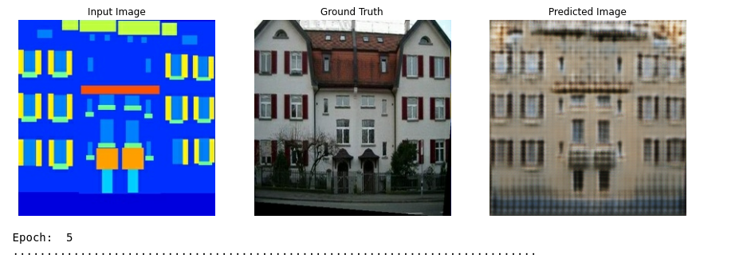
## 2-3
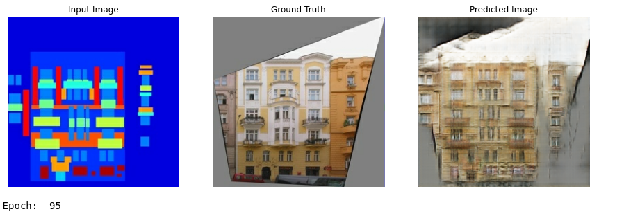
## 2-4
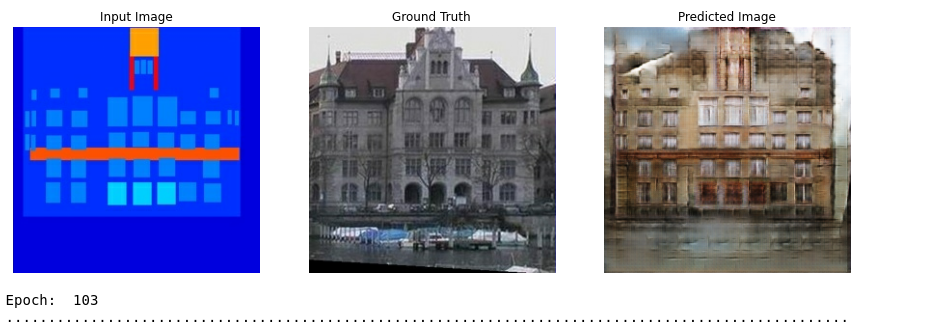
## 2-5
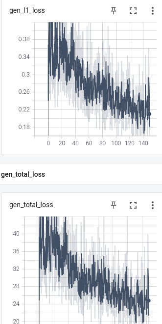
## 3-1
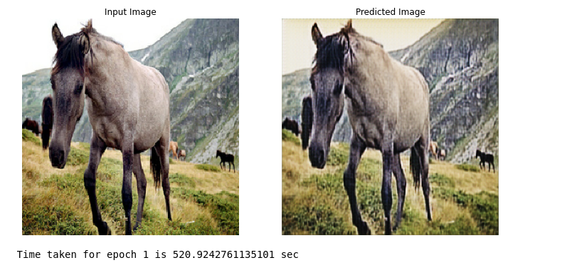
## 3-2
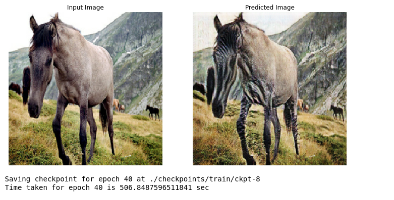
## 3-3
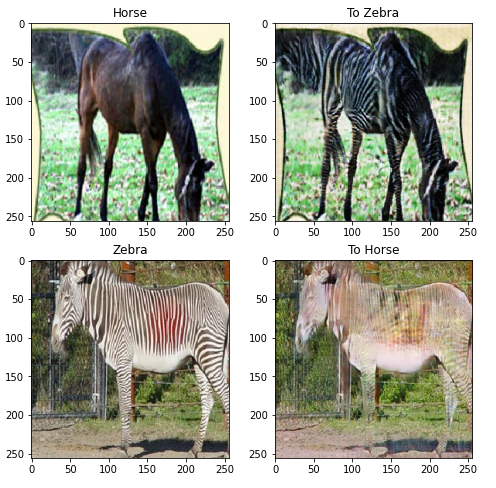
## 4-1
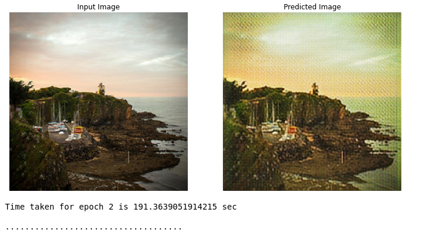
## 4-2
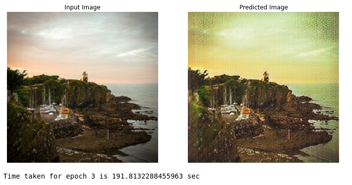
## 4-3
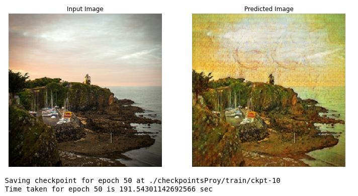
## 4-4
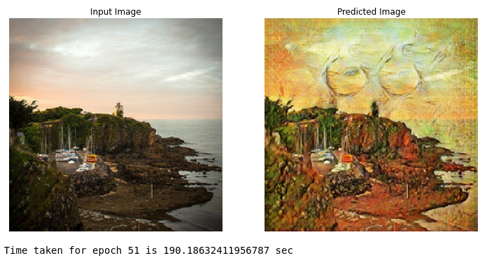
## 4-5
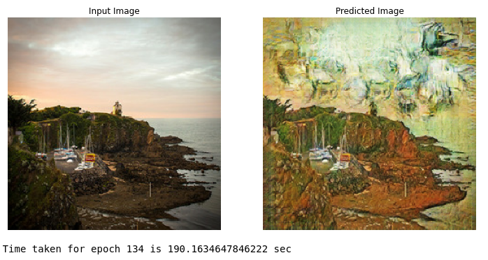
## 4-6
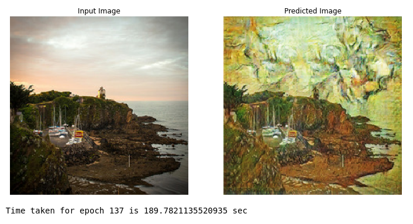
## 4-7
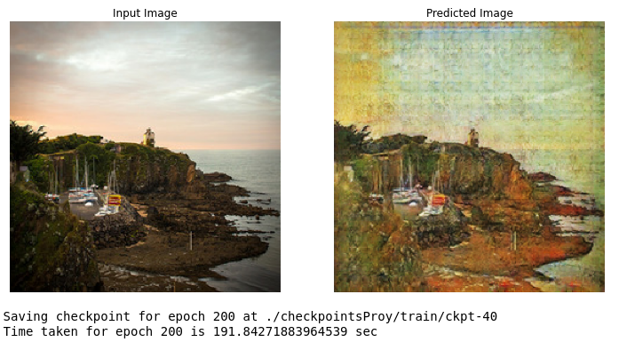
## 4-8
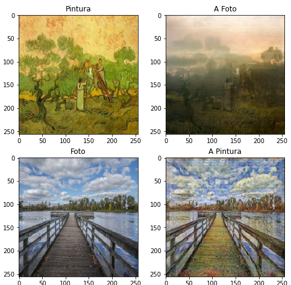
## 4-9
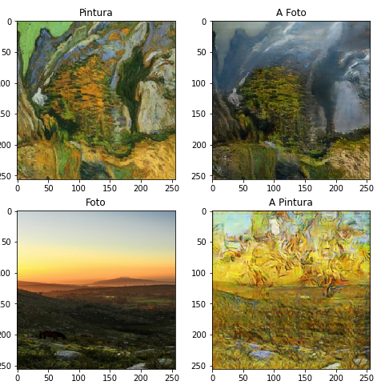
## 5-1
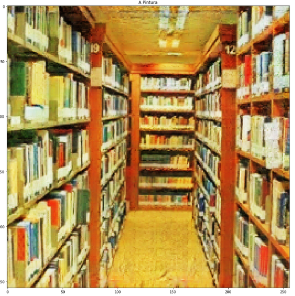 | 
## 5-2
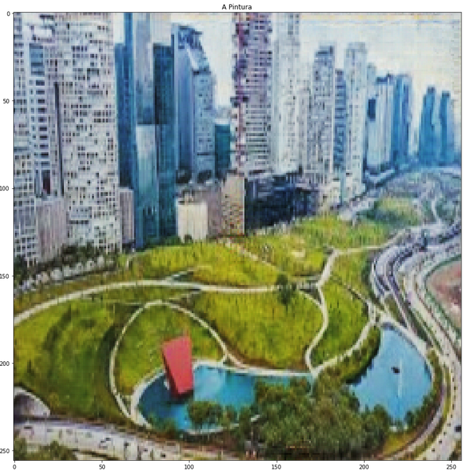
## 5-3
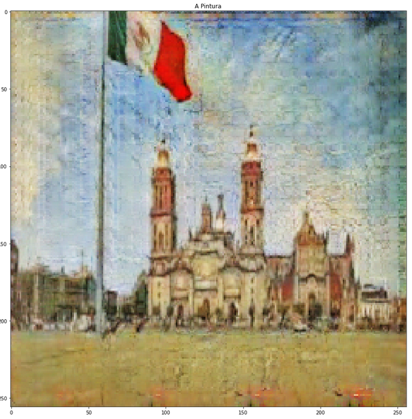
## 5-4
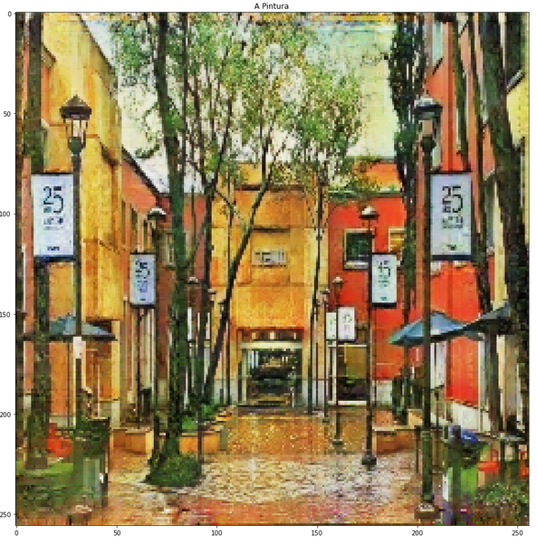
## 5-5
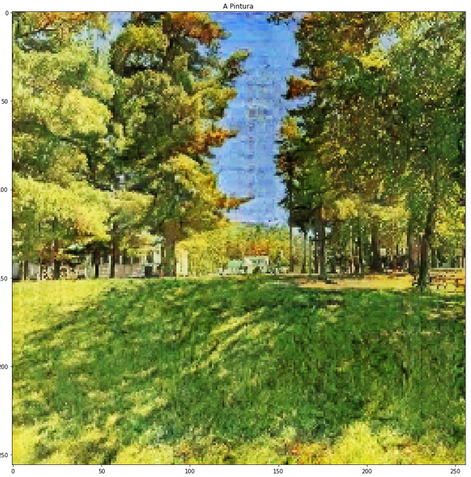
## 5-6
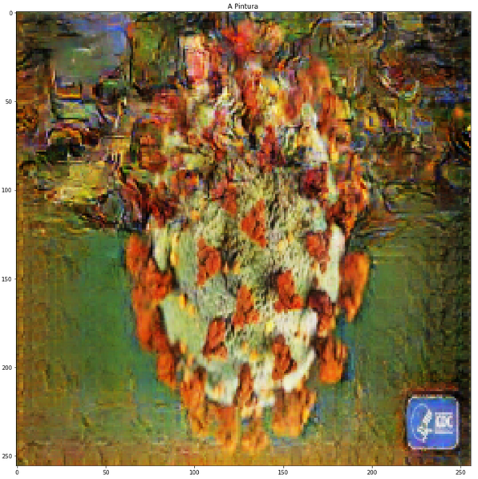
## 5-7
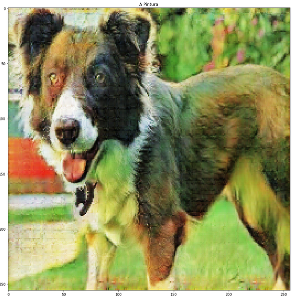
## 5-8

## 5b-1

## 5b-2

## 5b-3

## 5b-4

## 5b-5

## 5b-6

## 5b-7

## 5b-8

